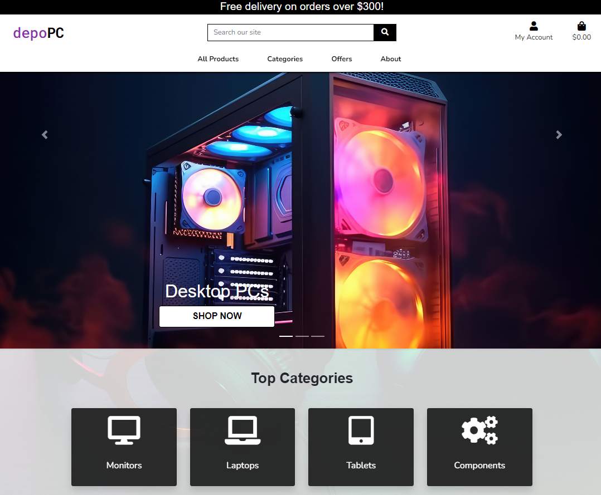
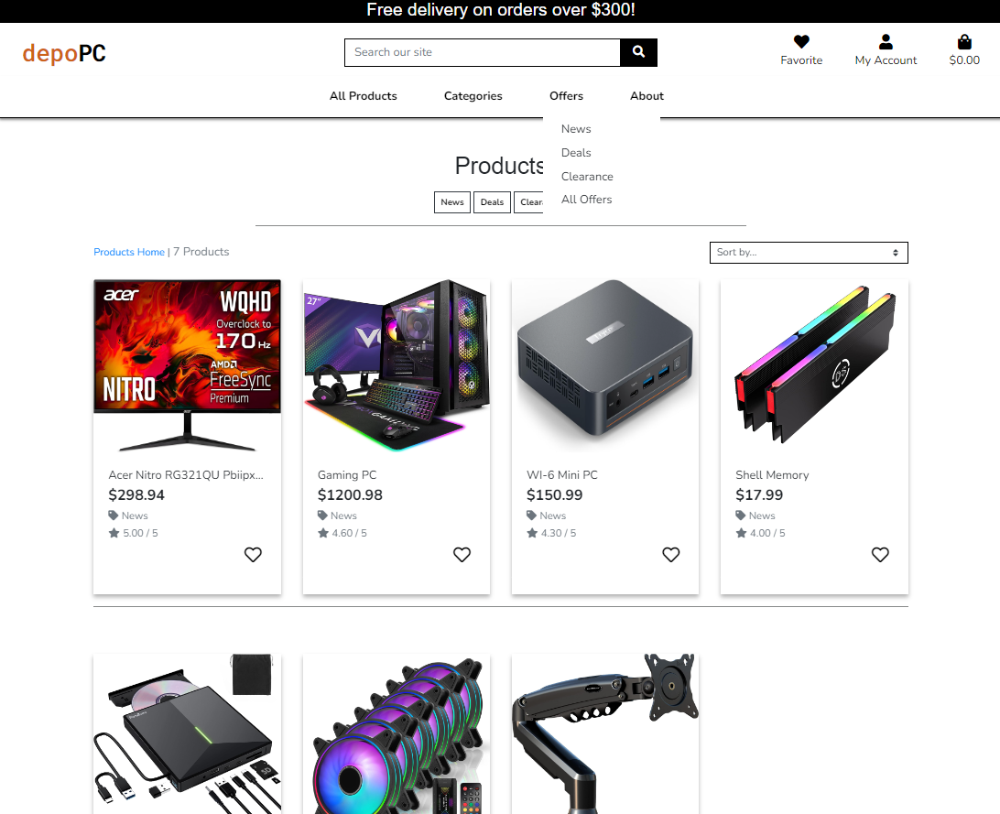
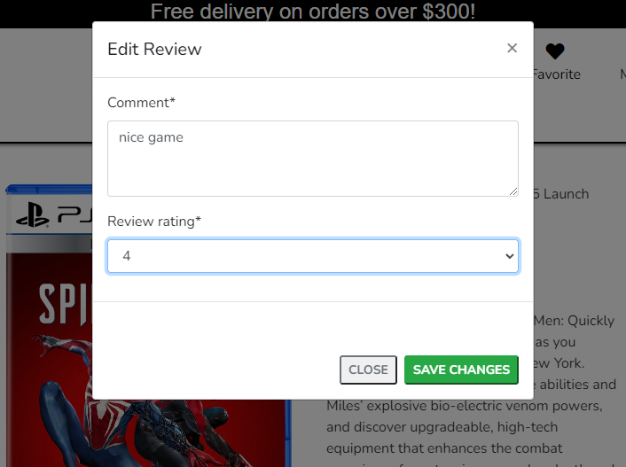
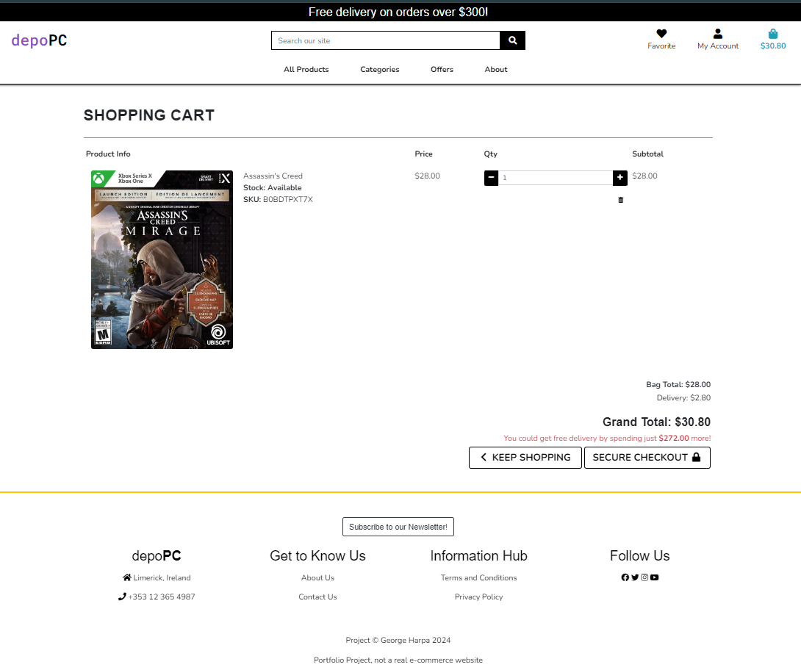
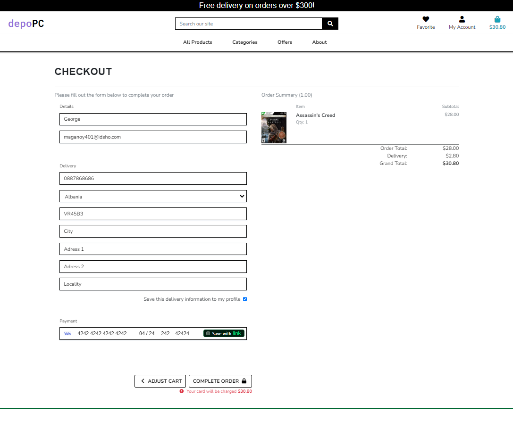
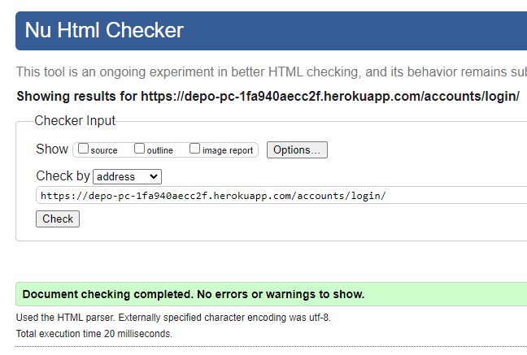
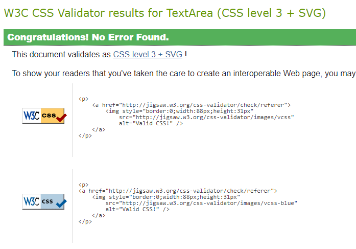

# depo PC 

Welcome to Depo PC: Your Ultimate Computer Hardware Haven!

Depo PC is your one-stop destination for all things computer hardware. Dive into a world where cutting-edge technology meets seamless e-commerce, offering a curated selection of top-notch components, peripherals, and accessories. Our platform is designed to cater to tech enthusiasts, gamers, and professionals alike, providing a hassle-free shopping experience for all your computing needs.

Visit the live site - [depo PC](https://depo-pc-1fa940aecc2f.herokuapp.com/ "Link to depo PC")

--

## CONTENTS

* [Project Overview](#project-overview)
  * [Project Goals](#project-goals)

* [User Experience](#user-experience)
  * [User Expectations](#user-expectations)
  * [User Stories](#user-stories)

* [E-Commerce Business model](#e-commerce-business-model)
  * [Facebook Marketing](#facebook-marketing)
  * [SEO](#seo)

* [Design](#design)
  * [Color Scheme](#color-scheme)
  * [Imagery](#imagery)
  * [Structure](#structure)
  * [Database Design](#database-design)
  * [Wireframes](#wireframes)

* [Agile Project Management](#agile-project-management)

* [Features](#features)

* [Future Implementations](#future-implementations)

* [Technologies Used](#technologies-used)
  * [Languages Used](#languages-used)
  * [Programs Used](#programs-used)

* [Deployment](#deployment)

* [Testing](#testing)

* [Credits](#credits)
  * [Code used and adapted](#code-used-and-adapted)
  * [Acknowledgments](#acknowledgments)

---

## **Project Overview**
Explore a diverse catalog of top-tier computer hardware, from CPUs and GPUs to gaming peripherals. Benefit from expert reviews, detailed product descriptions, and insightful buying guides for informed decisions. Enjoy a user-friendly interface that guarantees a smooth and enjoyable shopping journey. Shop with confidence, knowing that every transaction is secure, and your personal information is handled with care.

**Admin**

**Note for testing the checkout functionality:**

To keep your personal information secure, it is advised to use Stripe test Visa card:
* Card Number: 4242 4242 4242 4242
* MM/YY: 4242
* CVC: 424
* ZIP: 24242
[small](Use 42.. for all of them, to prevent issues)

### **Project Goals**

- **Comprehensive Catalog:** Curate a diverse collection of cutting-edge computer hardware.
- **User-Friendly Interface:** Ensure a seamless and enjoyable shopping journey.
- **Expert Guidance:** Provide expert reviews and buying guides for informed decisions.
- **Security and Trust:** Prioritize user data security and trustworthy transactions.
- **Community Engagement:** Foster a vibrant community of tech enthusiasts.
- **Innovation in Technology:** Stay at the forefront of technological advancements.
- **Customer Satisfaction:** Strive for excellence with responsive support and efficient service.

[Back to top ⇧](#depo-PC)

---

## **User Experience**

### **User Expectations**

At **Depo PC**, we strive to meet and exceed user expectations, providing a seamless and rewarding experience for every customer.

- **Product Quality:** Expect top-tier computer hardware from renowned brands, ensuring superior performance and reliability.

- **Effortless Navigation:** Our user-friendly interface ensures easy exploration, making it simple for users to find and purchase the products they need.

- **Timely Support:** Count on responsive customer support to address queries and ensure a smooth shopping experience.

- **Informed Decisions:** Benefit from expert reviews, buying guides, and detailed product information to make well-informed decisions tailored to your unique needs.

- **Secure Transactions:** Rest assured with our commitment to data security, ensuring all transactions are handled with the utmost care.

### **User Stories**

The user stories were developed for the project using Agile development methodology, the full list can be seen in the [depoPC Project.](https://github.com/users/GeorgeH23/projects/4/views/1 "Link to depo PC Project"). Below I have described the important fetures of the project.

#### **First Time Visitor**
1. **Explore Our Catalog:**
   - *Objective:* Discover a diverse range of cutting-edge computer components, peripherals, and accessories.
   - *Experience:* Navigate through our user-friendly interface, allowing you to explore our extensive catalog effortlessly.

2. **Expert Guidance:**
   - *Objective:* Make informed decisions with expert reviews and detailed product information.
   - *Experience:* Benefit from expert recommendations and buying guides to understand and choose the right products for your needs.

3. **Secure Shopping:**
   - *Objective:* Ensure your transactions are secure and your personal information is handled with care.
   - *Experience:* Shop with confidence, knowing that we prioritize the security of your data and transactions.

4. **Community Engagement:**
   - *Objective:* Connect with a vibrant community of tech enthusiasts.
   - *Experience:* Engage in discussions, share insights, and stay updated on the latest trends in computer hardware.

5. **Responsive Design:**
   - *Objective:* Enjoy a seamless experience across all devices.
   - *Experience:* Whether you're on your desktop or mobile device, our responsive design ensures a consistent and enjoyable shopping experience.

#### **Returning Customer**
1. **Familiar Navigation:**
   - *Expectation:* Navigate with ease using our familiar and user-friendly interface.
   - *Experience:* The platform's consistency ensures that returning customers quickly find their way around, making the shopping process smooth.

2. **Personalized Recommendations:**
   - *Expectation:* Receive personalized recommendations based on your previous purchases and preferences.
   - *Experience:* Enjoy a tailored shopping experience with suggestions that align with your unique needs and interests.

3. **Order History and Tracking:**
   - *Expectation:* Access your order history and easily track the status of your current orders.
   - *Experience:* Retrieve information on past purchases and stay updated on the progress of your latest orders conveniently.

4. **Exclusive Offers:**
   - *Expectation:* Explore exclusive offers and promotions available to returning customers.
   - *Experience:* As a valued customer, access special deals and promotions that add extra value to your shopping experience.

#### **Website Admin/Owner**
1. **Manage Product Catalog:**
   - *Responsibility:* Curate and update the product catalog with the latest computer hardware offerings.
   - *Tools:* Utilize the admin panel to add, edit, or remove products seamlessly.

2. **User Management:**
   - *Responsibility:* Oversee user profiles, ensuring a secure and personalized experience for each customer.
   - *Tools:* Access user data and profiles through the admin panel to provide tailored support and services.

[Back to top ⇧](#depo-PC)

---

## **E-Commerce Business Model**

**Depo PC** adopts a comprehensive B2C (business-to-consumer) model, specializing in the direct sale of cutting-edge computer components, monitors, laptops, games and accessories. Here's an overview of our business model:

1. **Diverse Product Selection:**
   - *What We Offer:* Dive into a diverse collection of top-tier computer components, monitors, laptops, games and accessories. We're your one-stop destination for all things tech.

2. **Seamless Shopping Experience:**
   - *No Frills Checkout:* Skip the lengthy sign-ups. Enjoy a straightforward shopping experience designed for quick and easy checkout.

3. **Smart Discounts, Smart Savings:**
   - *Unlock Deals:* Take advantage of dynamic discounts on delivery and bulk buys. Buy > $300 and save the delivery fee.

4. **Community Building on Social Media:**
   - *Connect with Us:* Find us on Facebook for the latest tech trends and exclusive deals. It's not just a store; it's a community of tech enthusiasts.

5. **Tech Enthusiast's Haven:**
   - *Who We Cater To:* Tailored for tech enthusiasts like yourself, always on the lookout for the newest and coolest in the tech world.

6. **User-Centric Design:**
   - *Navigating Made Easy:* Our website is designed with simplicity in mind. It's user-friendly, allowing you to effortlessly sign up for newsletters and engage with us.

7. **Owner's Control Center:**
   - *In Charge:* The owner seamlessly manages the store, ensuring a smooth operation. They're the captain steering the ship to provide you with the best tech shopping experience.

8. **Tech Talk Community:**
   - *Join the Conversation:* Immerse yourself in our tech community. Share insights, tips, and stay updated on the latest tech buzz.

### **Facebook Marketing**

Dive into the heart of Depo PC's Facebook page, where daily tech adventures, exclusive deals. Join us behind the scenes, showcase your tech setup, and snag cool giveaways – because at Depo PC, our Facebook community is all about sharing the love for tech, one post at a time!

### **SEO**
Our project integrates descriptive meta tags in our base.html head, ensuring that each visit is optimized for search engines. We've fine-tuned our sitemap.xml and robots.txt to enhance visibility, making it effortless for you to find the latest tech gems.

But we don't stop there. Our newsletter subscription, powered by MailChimp, keeps you in the loop with tech updates. Elevate your tech discovery experience with Depo PC's SEO excellence!

[Back to top ⇧](#depo-PC)

---

## **Design**

### **Color Scheme**
- The color palette used in the website:
  - Primary Color: white;
  - Secundary Color: black.
  - Button Colors: gray, red, green.
  - Text Color: #000000, #FFFFFF.

### **Structure**

  - depo PC website is structured in a user-friendly and easy to navigate way.

  - *Home page:*
    - The homepage serves as the landing page for my application. A carousel slides was added as a first view. A bit down I created tiles with the top categories from the store. All was set with css and Bootstrap. The button 'shop now' is a path to the products page.
        

  - *Navbar*
    - The navbar provides a navigation menu for users to easily access different sections of the application. It includes links to the homepage, user profile, products, categories, offers, favorites and other relevant pages. 

  - *Footer:*
    - The footer is located at the bottom of the page and contains 4 sections: the address, the social media, get to know us and information hub. It provides a consistent location for secondary navigation. A rainbow solid line was added to separate the footer and the rest of the content from the pages.
        

  - *Products page*
    - Includ all the categories, subcategories and sorting options. A list with all products from the shop are available here. In the left corner we can see how many products are in the list. On the right is a dropdown that give us the chance to sort the produc list. Multiple filters available.
    - If you are logged in the app you are able to add/remove products to/from the Favorites page by pressing the heart located on each product card.
    - If you are not logged, the heart will not be displayed so the functionality will not be available.
        
    
    - If we are going through the nav menu, we can choose to see the products sorted: by-price, by-rating, by-category and all-products. The option choosed to be displayed on the image from below is by-price one.
        
   
    - The next option is Categories. Here we can see all the categories that are available. This 'filter' will sort the products from the stor base on the type of it. In the example from below, the 'Games' category was choosed.
        

    - The third option is with Offers. Here the user can find products that are new or products that are a good deal. Below the all-ofers categories is displayed.
        

    - The last tab from the nav menu is the About section. Here the user can find the the privacy, terms and conditions, contact us and about us pages. Below all pages will be displayed.
        
        
        

      - The Contact form will send a copy email with the message that the user have sent via Contact Us form.
        
        

  - *Product Details page*
    - Each product can bee seen closer. Details of the product are displayed. 
    - The posibility of adding in the cart the quantity that the user whant to buy.
    - The posibility of going back to the products page.
    - The posibility of adding the product into Favorites page, or remove it from it.
        

    - The posibility of adding reviews on the product. A modal will open and will let the user to write the review.
        
    - The user is able to add/edit/delete his own review. the review off other users will not have an edit/delete option.
        
        
        
    - The review pagination. The user can go through the reviews, page by page or go directly to the last one and back to first after that.
        
    - The admin will not be able to add reviews, the button will be hiden, but is able to delete the all reviews of all other users.
        

  - *Favorites page*
    - The Favorites page help the user to see an overview of the products that may be interested.
    - The user is able to remove the product from the list or can add it into the cart.
    - On the bottom of the page we have the tiles with categories, to make the user to spend more time on the site.
        

  - *Cart page*
    - Shopping cart list is available here. The user can modify the quantity of the product without to go back to the product details. Or is able to remove it from the cart.
    - On the bottom of the shopping cart the total is displyed and you have 2 options: to finish and pay or to go back to the site store.
        

  - *Checkout page*
    - If the user choose to pay, the next step is the checkout form, where the user add all need it details.
        

  - *Checkout Success page*
    - The order has been placed, a thank you page will next, where the user will be informed that a copy of the order was sent to the email. A summary of the order is displayed and the posibility to see the Products that are on Deals category.
        
        

  - *Registerig, logging in/out:*  
    - First time/unregistered user can successfully make a purchase without registering.
    - The login and registration pages contain an allauth form.
        
        
        
        
        
        

  - *Profile:*  
    - On the profile page the user is able to see an order history for his orders, the ones placed logged in or not. Based on emails all the history is displayed.
    - The last details that the user has wrote into the order will be autofiled in the form. Also is the option of updating the details.
        
    - The user is able to open each order and see the details about it.
        

  - *Product Management:*  
    - The admin is able to add new products to the site. 
    - Is able to Edit/Delete products from the site
        
        

  - *Subscription:*  
    - The user is able to subscribe to our site.
        
        

  - *Error Handle:*  
    - Custom errors
        
        
        
        

### **Database Design**

   - Order model:

|Name|Database Key|Field Type|Validation|
|---|---|---|---|
|order_number|order_number|CharField|max_length=32, null=False, editable=False|
|user_profile|user_profile|ForeignKey|'UserProfile', null=True, blank=True, on_delete=models.SET_NULL, related_name='orders'|
|full_name|full_name|CharField|max_length=50, null=False, blank=False|
|email|email|EmailField|max_length=254, null=False, blank=False|
|phone_number|phone_number|CharField|max_length=20, null=False, blank=False|
|country|country|CountryField|blank_label='Country *', null=False, blank=False|
|postcode|postcode|CharField|max_length=20, null=True, blank=True|
|town_or_city|town_or_city|CharField|max_length=40, null=False, blank=False|
|street_address1|street_address1|CharField|max_length=80, null=False, blank=False|
|street_address2|street_address2|CharField|max_length=80, null=True, blank=True|
|county|county|CharField|max_length=80, null=True, blank=True|
|date|date|DateTimeField|auto_now_add=True|
|delivery_cost|delivery_cost|DecimalField|max_digits=6, decimal_places=2, null=False, default=0|
|order_total|order_total|DecimalField|max_digits=10, decimal_places=2, null=False, default=0|
|grand_total|grand_total|DecimalField|max_digits=10, decimal_places=2, null=False, default=0|
|discount_applied|discount_applied|BooleanField|default=False|
|original_cart|original_cart|TextField|null=False, blank=False, default=''|
|stripe_pid|stripe_pid|CharField|max_length=254, null=False, blank=False, default=''|

   - OrderLineItem model

|Name|Database Key|Field Type|Validation|
|---|---|---|---|
|order|order|ForeignKey|'Order', null=False, blank=False, on_delete=models.CASCADE, related_name='lineitems'|
|painting|painting|ForeignKey|'Painting', null=False, blank=False, on_delete=models.CASCADE|
|frame|frame|CharField|max_length=20, null=True, blank=True|
|lineitem_total|lineitem_total|DecimalField|max_digits=6, decimal_places=2, null=False, blank=False, editable=False|

   - Category model

| Name          | Database Key  | Field Type    | Validation     |
| ------------- | ------------- | ------------- | -------------- |
| name          | name          | CharField     | max_length=254 |
| friendly_name | friendly_name | CharField     | max_length=254, null=True, blank=True |

   - Product model

| Name        | Database Key  | Field Type        | Validation                |
| ----------- | ------------- | ----------------- | ------------------------- |
| category    | category      | ForeignKey        | 'Category', null=True, blank=True, on_delete=models.SET_NULL |
| sku         | sku           | CharField         | max_length=254, null=True, blank=True |
| name        | name          | CharField         | max_length=254            |
| description | description   | TextField         |                           |
| price       | price         | DecimalField      | max_digits=6, decimal_places=2 |
| image       | image         | ImageField        | null=True, blank=True     |

   - UserProfile model:

| Name                   | Database Key            | Field Type        | Validation                  |
| ---------------------- | ----------------------- | ----------------- | --------------------------- |
| user                   | user                    | OneToOneField     | 'User', on_delete=models.CASCADE |
| default_phone_number   | default_phone_number    | CharField         | max_length=20, null=True, blank=True |
| default_street_address1| default_street_address1 | CharField         | max_length=80, null=True, blank=True |
| default_street_address2| default_street_address2 | CharField         | max_length=80, null=True, blank=True |
| default_town_or_city   | default_town_or_city    | CharField         | max_length=40, null=True, blank=True |
| default_county         | default_county          | CharField         | max_length=80, null=True, blank=True |
| default_postcode       | default_postcode        | CharField         | max_length=20, null=True, blank=True |
| default_country        | default_country         | CountryField      | blank_label='Country', null=True, blank=True |

   - Contact model

| Name             | Database Key     | Field Type    | Validation                                 |
| ---------------- | ---------------- | ------------- | ------------------------------------------ |
| contact_reason   | contact_reason   | CharField     | max_length=24, choices=CONTACT_REASONS    |
| name             | name             | CharField     | max_length=100                             |
| email            | email            | EmailField    | max_length=100                             |
| phone            | phone            | CharField     | max_length=20, blank=True, null=True       |
| message          | message          | TextField     | max_length=1000                            |
| date_submitted   | date_submitted   | DateTimeField | auto_now_add=True                         |

## **Agile Project Management**

- [depoPC Project Board](https://github.com/users/GeorgeH23/projects/4/views/1)

User stories/tasks development

**Epics**
- EPIC: Admin Functions epic must-have
- EPIC: Checkout Process epic must-have
- EPIC: Purch Process epic must-have
- EPIC: Search and Sort Products epic must-have
- EPIC: Products epic must-have
- EPIC: Home Page and Navigation epic should-have
- EPIC: Contact Page epic should-have
- EPIC: User Authentication epic should-have
- EPIC: Favorites list could-have epic

**Stories**
- USER STORY: Delete Product By Admin must-have user story
- USER STORY: Edit/Update Product by Admin must-have user story
- USER STORY: Add Product by Admin must-have user story
- USER STORY: Checkout Page must-have user story
- USER STORY: Purch bag must-have user story
- USER STORY: Result summary must-have user story
- USER STORY: Multiple filters should-have user story
- USER STORY: Filter Searched Products must-have user story
- USER STORY: Sort Products must-have user story
- USER STORY: Total Price easy to see should-have user story
- USER STORY: Product Offers must-have user story
- USER STORY: Product details Page must-have user story
- USER STORY: Products page must-have user story
- USER STORY: Navigation Menu should-have user story
- USER STORY: Home Page should-have user story
- USER STORY: Create Contact Page should-have user story
- USER STORY: User Login Page should-have user story
- USER STORY: User Registration should-have user story
- USER STORY: Favorites Page must-have user story
- USER STORY: Remove Products from the Favorite list must-have user story
- USER STORY: Add Products to the Favorites list must-have user story
- USER STORY: Order Confirmation must-have user story
- USER STORY: Project Set Up must-have user story
- USER STORY: Add Paginator for Review section should-have user story
- USER STORY: Edit/Delete the own review should-have user story
- USER STORY: Add Review section should-have user story

**Bugs**
- BUG: Navigation not working for 'ABOUT' section
- BUG: Emails not working
- BUG: User with empty list of favorites
- BUG: Missing favicon
- BUG: Missing server error pages
- BUG: History order display issue
---

[Back to top ⇧](#depo-PC)

---

## **Features**

All of the features presented in this sections are fully responsive on all devices and screen widths.
Please refer to [TESTING.md](/TESTING.md) for more information about responsiveness testing.

## **Future Implementations**

The following features could be added to CAG in the future. Project deadline influenced heavily what was left out.

  - Add Social sign-in options (Google, GitHub, Facebook)
  - Add AI powered Recommendation
  - Add interactiv Forum

[Back to top ⇧](#depo-PC)

---

## **Technologies Used**

### **Languages Used**

- [HTML](https://en.wikipedia.org/wiki/HTML5) - For adding content and formatting.
- [CSS](https://en.wikipedia.org/wiki/CSS) - For adding style and colours.
- [JavaScript](https://en.wikipedia.org/wiki/JavaScript) - For adding interactive features.
- [Python](https://en.wikipedia.org/wiki/Python_(programming_language)) - High-level, general-purpose programming language.

### **Django and Python Packages**

- [asgiref](https://pypi.org/project/asgiref/) - a standard interface between web servers and Python web applications.
- [boto3](https://pypi.org/project/boto3/) - providing access to AWS services.
- [botocore](https://pypi.org/project/botocore/) - Low-level, core functionality of AWS SDK for Python (Boto3).
- [dj-database-url](https://pypi.org/project/dj-database-url/) - A utility for utilizing database URLs in Django applications.
- [Django](https://www.djangoproject.com/) - A Python-based web framework that follows the model-template-view architectural pattern, used for building the project.
- [django-allauth](https://django-allauth.readthedocs.io/) - A Django application used for account registration, management, and authentication.
- [django-countries](https://pypi.org/project/django-countries/) - A Django application for providing country choices for forms.
- [django-crispy-forms](https://pypi.org/project/django-crispy-forms/) - A Django application that makes it easy to style Django forms.
- [django-storages](https://pypi.org/project/django-storages/) - A collection of custom storage backends for Django.
- [gunicorn](https://pypi.org/project/gunicorn/) - A Python Web Server Gateway Interface (WSGI) HTTP server.
- [jmespath](https://pypi.org/project/jmespath/) - A query language for JSON, allowing you to search and manipulate JSON data.
- [oauthlib](https://pypi.org/project/oauthlib/) - A generic and reusable Python library for implementing OAuth1 and OAuth2 providers.
- [Pillow](https://pypi.org/project/Pillow/) - The Python Imaging Library adds image processing capabilities to your Python interpreter.
- [psycopg2](https://pypi.org/project/psycopg2/) - A PostgreSQL adapter for Python.
- [python3-openid](https://pypi.org/project/python3-openid/) - A set of Python packages for implementing OpenID Connect.
- [requests-oauthlib](https://pypi.org/project/requests-oauthlib/) - OAuthlib authentication support for Requests.
- [s3transfer](https://pypi.org/project/s3transfer/) - An Amazon S3 Transfer Manager for Python.
- [sqlparse](https://pypi.org/project/sqlparse/) - A non-validating SQL parser module for Python.
- [stripe](https://pypi.org/project/stripe/) - A Python library for the Stripe API.
- [urllib3](https://pypi.org/project/urllib3/) - A powerful HTTP client for Python, which provides features such as connection pooling, request retries, and more.

### **Programs/Tools Used**

- [Amazon AWS](https://aws.amazon.com/) - Used to store the static and media files for the site.
- [Mailchimp](https://mailchimp.com/) - Used to create the newsletter signup form.
- [Stripe](https://stripe.com/gb) has been used for the payment processing and webhooks handling.
- [GitHub](https://github.com/) - Source code hosted on GitHub, deployed using Git Pages.
- [Font Awesome](https://fontawesome.com/) - Font Awesome use to source necessary icons used in the project.
- [Balsamiq](https://balsamiq.com/) - Used to create wireframes and website structure map for the project.
- [Google Keep](https://keep.google.com/) - Used to make notes during the project duration.
- [LanguageTool](https://languagetool.org/) - Used for general spell-check.
- [Google Fonts](https://fonts.google.com/) - Used to import fonts to the project.
- [GifCap](https://gifcap.dev/) - Used to capture gif-s of the project.
- [Heroku](https://www.heroku.com/) - Used to deploy the project.
- [Lucidchart](https://www.lucidchart.com/pages/examples/flowchart-maker) - Used to make the iteration flowchart for the project.
- [Bootstrap clean blog](https://startbootstrap.com/theme/clean-blog) - Bootstrap blog template imported in for content management and CSS.
- [ElephantSQL](https://www.elephantsql.com/) - Free and open-source relational database management system (RDBMS).
- [Bootstrap5](https://getbootstrap.com/) - Used for adding predefined styled elements and creating responsiveness.
- [Pixillion Image Converter](https://www.nchsoftware.com/imageconverter/index.html?ns=true&kw=pixillion%20image%20converter&gclid=Cj0KCQiA99ybBhD9ARIsALvZavXKEsfJf5-WRUHKOv8Luf35hSJFHVg7l8SLYQtDfGnAyDrmVsToYwgaAtHqEALw_wcB) - Used to convert the images into webp format
- [Email on Deck](https://www.emailondeck.com/) - Used for testing various email communication/verification.
- [WebsitePolicies](https://www.websitepolicies.com/terms-and-conditions-generator) - Used to create T&C's for the project.
- [TermsFeed](https://www.termsfeed.com/privacy-policy-generator/) - Used to create Privacy Policy for the project.
- [JsHint](https://jshint.com/) - Used for validating the javascript code.
- [CI Python Linter](https://pep8ci.herokuapp.com/#) - Used for validating the python code.
- [HTML W3C HTML Validator](https://validator.w3.org/#validate_by_uri+with_options) - Used for validating the HTML.
- [CSS Jigsaw CSS Validator](https://jigsaw.w3.org/css-validator/#validate_by_uri) - Used for validating the CSS.
- [Chrome Del Tools](https://developer.chrome.com/docs/devtools/) - For debugging the project.
- [W.A.V.E.](https://wave.webaim.org/) - Used for testing accessibility.
- [LightHouse](https://developer.chrome.com/docs/lighthouse/overview/) - Used for testing performance.

[Back to top ⇧](#depo-PC)

---

## Deployment

- This project was developed using [CodeAnyWhere](https://codeanywhere.com/).
- I have used the terminal to commit changes in my GitHub repository.
- In the GitHub I have created User Stories and Epics, the commits are related to them based on the id that gitHub generated for each issue that was created.

### Prepare before Deploy
1. Create an `.env` file in your project, at root level.
2. Add in this file your secret keys.
3. Run `pip3 install -r requirements.txt` to install needed packages.
4. Run `python3 manage.py migrate` to migrate your DB models.
5. Run `python3 manage.py createsuperuser` to create a superuser.
6. Run `python3 manage.py runserver` to start the server.
7. Create an `Procfile` file in your project, at root level.

### Deploying on Heroku Pages
To deploy this web app to Heroku Pages from GitHub repository, the following steps were taken:

1. Log into [GitHub](https://github.com/login "Link to GitHub login page") or [create an account](https://github.com/join "Link to GitHub create account page").
2. Locate the [GitHub Repository](https://github.com/GeorgeH23/gym-pro-fitness "Link to GitHub Repo").
3. Create an account on [Heroku:](https://dashboard.heroku.com/apps).
4. Create a new Heroku app.
5. Set the BuilPacks and the Config Vars.
6. Link the Heroku app to the git hub repository.
7. Set up AWS hosting for static and media files.
8. Creating AWS groups, policies and users.
9. Connecting Django to S3 bucket.
10. Setting up Stripe
11. Update the Config Vars.
12. Click on Deploy.

###### [Back to top ⇧](#table-of-contents)

## **Testing**

## Automated Testing

### **W3C HTML Validator**

The [HTML W3C HTML Validator](https://validator.w3.org/#validate_by_uri+with_options) was used to validate the HTML code used, showing no errors.

HTML Validation:

 - About
  

 - Add Review
  

 - Products By Category
  

 - Products By Price
 

 - Products By Rating
  

 - Cart
  

 - Checkout Success
  

 - Checkout
  

 - Contact Us
  

 - Favorite Remove
  

 - Favorite
  

 - Index
  

 - Laptops
  

 - Login
  

 - Logout
  

 - Monitor
  

 - Order History
  

 - Privacy
  

 - Product
  

 - Products Add
  

 - Products Edit
  

 - Products
  

 - Profile
  

 - Subscribe
  

 - T and C
  

### **W3C CSS Validator**

The [CSS Jigsaw CSS Validator](https://jigsaw.w3.org/css-validator/#validate_by_uri) was used to validate the CSS code used, showing no errors.

CSS Validation:

 - Base css
  

---

### **JSHINT Javascript Validator**

The [JsHint](https://jshint.com/) was used to validate the Javascript code used, showing no errors.

Javascript Validation:

 - Stripe
  

 - Favorite
  

### **CI Python Linter**

The [CI Python Linter](https://pep8ci.herokuapp.com/) was used to validate the Python code used, showing no errors.

Python Validation:

 - Cart
  

 - Checkout
  

 - Home
  

 - Products
  

 - Profile
  

 - Support
  

### **Lighthouse Auditing**

#### Desktop
| Page | Performance | Accessibility | Best Practice | SEO |
|------|:-------------:|:---------------:|:---------------:|:-----:|
| Home Page | 76% | 92% | 100% | 100% |
| Shop Pages | 69% | 90% | 96% | 100% |
| Login | 87% | 90% | 100% | 100% |
| Register | 90% | 91% | 100% | 100% |
| Contact | 90% | 87% | 100% | 98% |
| My Profile | 90% | 89% | 100% | 100% |
| Order History | 85% | 91% | 100% | 100% |
| Cart | 85% | 80% | 100% | 100% |
| Checkout Page | 89% | 94% | 100% | 100% |
| Checkout success Page | 91% | 90% | 94% | 100% |

#### Mobile
| Page | Performance | Accessibility | Best Practice | SEO |
|------|:-------------:|:---------------:|:---------------:|:-----:|
| Home Page | 70% | 92% | 100% | 100% |
| Shop Pages | 65% | 88% | 96% | 100% |
| Login | 85% | 90% | 100% | 98% |
| Register | 90% | 91% | 100% | 100% |
| Contact | 90% | 84% | 100% | 98% |
| My Profile | 90% | 89% | 98% | 100% |
| Order History | 79% | 90% | 100% | 100% |
| Cart | 85% | 76% | 100% | 100% |
| Checkout Page | 83% | 91% | 100% | 100% |
| Checkout success Page | 89% | 90% | 92% | 100% |

- The website performs well overall, there are areas for improvement, particularly in enhancing accessibility and performance on certain pages, especially on mobile devices. Consistency in SEO optimization is observed across all pages. 
- For future projects will be a good approach to regular monitoring, analysis, and optimization efforts will help to address these areas of improvement and maintain the website's competitiveness in the online landscape.

---

[Back to top ⇧](#depo-PC)

---

## **Credits**

### **Code used and adapted**

 - The Code Institute's [Boutique Ado](https://github.com/Boiann/boutique_ado) walkthrough project provided a lot of the site's original functionality, direction and design choices that were modified and expanded as needed. It was relied on heavily during whole development process and a lot of code is used directly from it, or with changes/updates to it.

 - [Boudoir Studio](https://boiann.github.io/boudoir-studio/index.html) ( GithHub repository [here](https://github.com/Boiann/boudoir-studio) ) and my previous project gym-pro-fitness. The ReadME file was inspired from my first project [Travel Addict](https://github.com/GeorgeH23/travel-addict/blob/main/README.md) and [Books4Life](https://github.com/tomdu3/books4life/) and [Art-gallery](https://cvek-art-gallery-d4a224801c39.herokuapp.com/)
- All other content was written by the developer

### **Websites visited for info and solutions**

Sites visited during the duration of the project.
[Google](https://google.com/ "Google home page") was used to produce results of the specific query,
[Stack Overflow](https://stackoverflow.com/ "Stack Overflow home page"),
[Django documentation](https://docs.djangoproject.com/en/4.2/),
[Bootstrap documentation](https://getbootstrap.com/docs/5.3/getting-started/introduction/).

[Back to top ⇧](#depo-PC)
